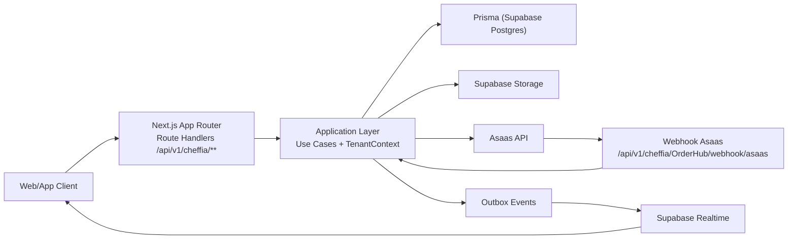
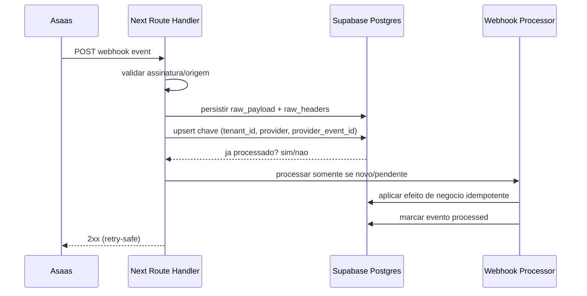
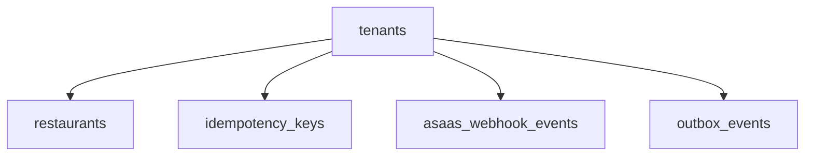

# Diagramas da migracao (baseline)

## 1) Arquitetura alvo (Next Route Handlers + Supabase + Asaas)

```mermaid
flowchart LR
  A["Web/App Client"] --> B["Next.js App Router<br/>Route Handlers /api/v1/cheffia/**"]
  B --> C["Application Layer<br/>Use Cases + TenantContext"]
  C --> D["Prisma (Supabase Postgres)"]
  C --> E["Supabase Storage"]
  C --> F["Asaas API"]
  F --> G["Webhook Asaas<br/>/api/v1/cheffia/OrderHub/webhook/asaas"]
  G --> C
  C --> H["Outbox Events"]
  H --> I["Supabase Realtime"]
  I --> A
```

## 2) Fluxo de webhook com idempotencia

```mermaid
sequenceDiagram
  participant Asaas
  participant API as Next Route Handler
  participant DB as Supabase Postgres
  participant UC as Webhook Processor

  Asaas->>API: POST webhook event
  API->>API: validar assinatura/origem
  API->>DB: persistir raw_payload + raw_headers
  API->>DB: upsert chave (tenant_id, provider, provider_event_id)
  DB-->>API: ja processado? sim/nao
  API->>UC: processar somente se novo/pendente
  UC->>DB: aplicar efeito de negocio idempotente
  UC->>DB: marcar evento processed
  API-->>Asaas: 2xx (retry-safe)
```

## 3) Modelo de dados inicial (Prisma)

```mermaid
flowchart TB
  T["tenants"] --> R["restaurants"]
  T --> IK["idempotency_keys"]
  T --> WE["asaas_webhook_events"]
  T --> OE["outbox_events"]
```
