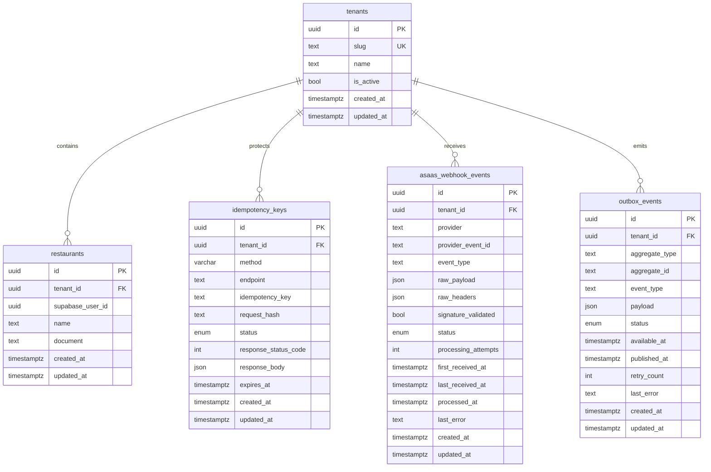

# Prisma ERD (baseline)

```mermaid
erDiagram
  tenants ||--o{ restaurants : contains
  tenants ||--o{ idempotency_keys : protects
  tenants ||--o{ asaas_webhook_events : receives
  tenants ||--o{ outbox_events : emits

  tenants {
    uuid id PK
    text slug UK
    text name
    bool is_active
    timestamptz created_at
    timestamptz updated_at
  }

  restaurants {
    uuid id PK
    uuid tenant_id FK
    uuid supabase_user_id
    text name
    text document
    timestamptz created_at
    timestamptz updated_at
  }

  idempotency_keys {
    uuid id PK
    uuid tenant_id FK
    varchar method
    text endpoint
    text idempotency_key
    text request_hash
    enum status
    int response_status_code
    json response_body
    timestamptz expires_at
    timestamptz created_at
    timestamptz updated_at
  }

  asaas_webhook_events {
    uuid id PK
    uuid tenant_id FK
    text provider
    text provider_event_id
    text event_type
    json raw_payload
    json raw_headers
    bool signature_validated
    enum status
    int processing_attempts
    timestamptz first_received_at
    timestamptz last_received_at
    timestamptz processed_at
    text last_error
    timestamptz created_at
    timestamptz updated_at
  }

  outbox_events {
    uuid id PK
    uuid tenant_id FK
    text aggregate_type
    text aggregate_id
    text event_type
    json payload
    enum status
    timestamptz available_at
    timestamptz published_at
    int retry_count
    text last_error
    timestamptz created_at
    timestamptz updated_at
  }
```
